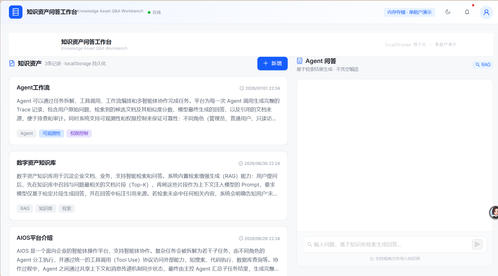
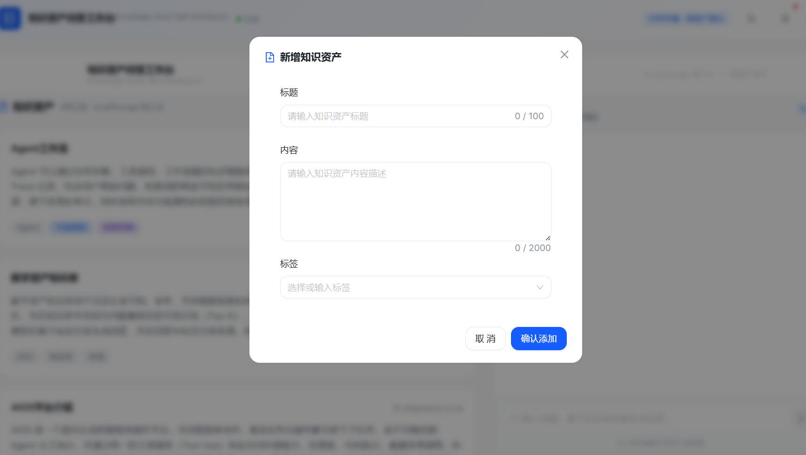
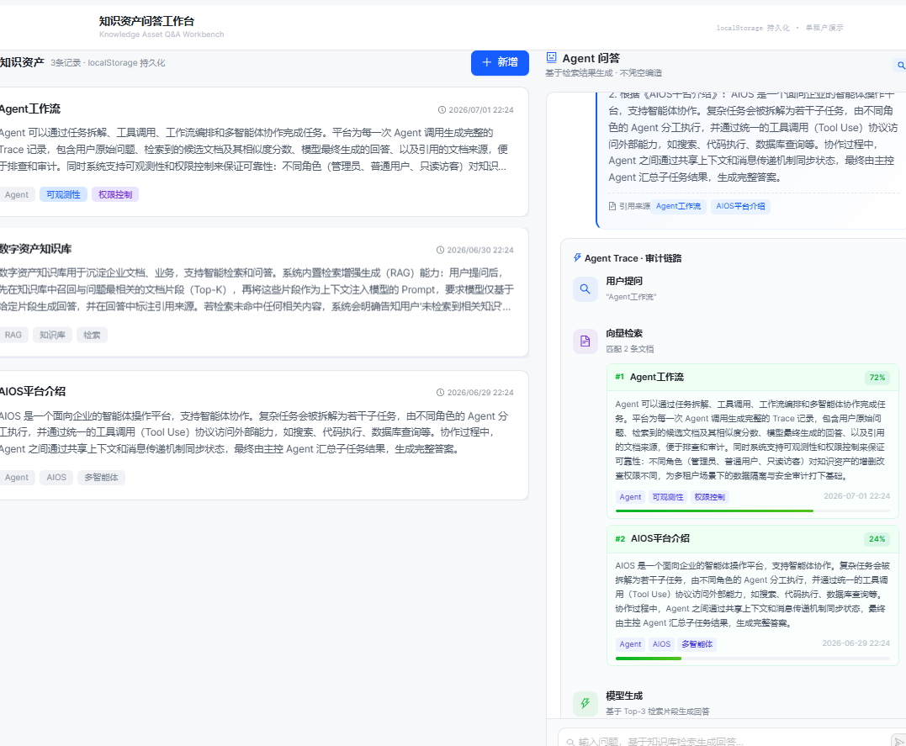
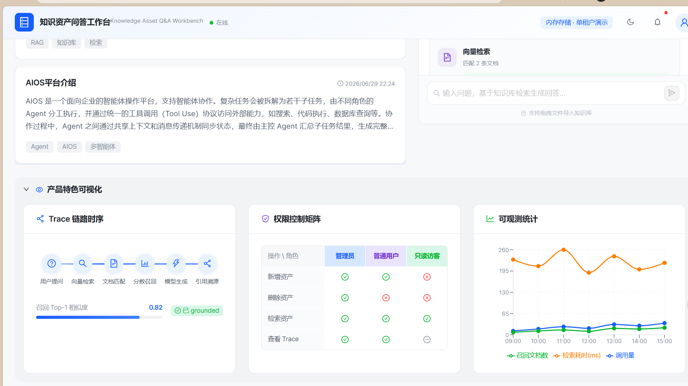

# AI 知识资产问答工作台

> 基于检索增强生成（RAG）思路实现的 ToB 知识库问答工作台。用户可维护知识资产列表，通过 Agent 对话框提问；Agent 严格基于检索到的资产内容作答，并展示完整的「检索 → 生成」全链路 Trace。


---

## 目录

- [在线演示](#在线演示)
- [项目截图](#项目截图)
- [一、启动方式](#一启动方式)
- [二、项目结构](#二项目结构)
- [三、必答 5 问](#三必答-5-问)
- [四、技术栈](#四技术栈)
- [五、Roadmap](#五roadmap)

---

## 在线演示

| 平台 | 链接 |
|------|------|
| Vercel | _部署后填入：https://your-app.vercel.app_ |
| GitHub | https://github.com/YHYHUKN/knowledge-agent-app |

---

## 项目截图

### 1. 工作台主界面


### 2. 新增知识资产


### 3. Agent 问答


### 4. Trace 检索链路可视化


> 📌 截图规范：1920×1080、亮色 / 暗色各一组、文件大小 < 500KB、命名 `01-xxx.png`。

---

## 一、启动方式

### 双击运行（推荐）

直接双击项目根目录下的 `start-dev.bat`，自动完成依赖安装并启动开发服务器。

- 启动后访问：**http://localhost:3000**
- 停止服务器：双击 `stop.bat`

### 命令行运行

```bash
npm install
npm run dev       # 开发模式
npm run build && npm start  # 生产模式
```

> **数据重置**：如需恢复默认 3 条种子数据，请在浏览器中按 F12 → Application → localStorage → 删除 `knowledge_assets_v1` 键，刷新页面即可。

---

## 二、项目结构

```
knowledge-agent-app/
├── start-dev.bat              ← 双击即可启动（开发模式）
├── start-prod.bat             ← 双击启动（生产模式）
├── stop.bat                   ← 停止服务器
├── HOW_TO_START.md            ← 启动方式详细说明
├── TECH_STACK.md              ← 技术选型说明
├── UNFINISHED_ITEMS.md        ← 未完成事项说明
├── ITERATION_PLAN.md          ← 继续迭代优化方向
├── PROJECT_STRUCTURE.md       ← 完整项目结构文档（含数据流向图 / 组件树）
│
├── docs/                      ← 演示与文档
│   ├── demo.gif               ← 项目演示录屏
│   └── screenshots/           ← 关键页面截图
│
├── app/                       Next.js App Router（页面 + API）
│   ├── layout.tsx             根布局（含 Ant Design ConfigProvider 双主题）
│   ├── page.tsx               首页入口
│   ├── globals.css            全局样式（CSS 变量 / 动画 / 响应式断点）
│   └── api/                   后端接口
│       ├── assets/route.ts    GET（列表）/ POST（新增）
│       ├── search/route.ts    POST（关键词检索 Top-3）
│       └── agent/chat/route.ts POST（Agent RAG 问答）
│
├── lib/                       核心业务逻辑（纯函数，可单测）
│   ├── types.ts               全局 TypeScript 类型定义
│   ├── data.ts                globalThis 内存存储 + 种子数据
│   ├── search.ts              关键词打分检索算法
│   ├── agent.ts               基于检索结果合成回答（Mock LLM）
│   ├── utils.ts               工具函数（cn / formatDateTime）
│   └── client-storage.ts      localStorage 持久化读写
│
├── components/
│   ├── app/                   业务组件
│   │   ├── workbench.tsx       主布局（双栏 + 状态提升）
│   │   ├── asset-list.tsx      知识资产列表（骨架屏 / 空状态）
│   │   ├── asset-form-dialog.tsx 新增资产弹窗表单
│   │   ├── chat-panel.tsx      Agent 问答对话面板
│   │   ├── trace-panel.tsx     Trace 检索过程可视化面板
│   │   └── visualization-panels.tsx 可视化特色面板（链路/权限/图表）
│   └── ui/                    基础 UI 组件（Button / Card / Dialog / Input）
└── README.md                  ← 本文件
```

---

## 三、必答 5 问

> 以下5问是笔试要求的必答题，本项目完整回答如下：

### 问题一：你如何设计知识资产的数据结构？

采用三个核心类型分层设计，对应 RAG 链路三个阶段：

**① `KnowledgeAsset`（存储层）**
```typescript
type KnowledgeAsset = {
  id: string;
  title: string;
  content: string;
  tags: string[];
  createdAt: string;
}
```
字段保持精简，`content` 存纯文本而非预切分的 chunk，为未来扩展预留空间（真实场景可拆为 `chunks: { id, text, embedding }[]`）。

**② `SearchResult`（检索层）**
```typescript
type SearchResult = {
  assetId: string;
  title: string;
  snippet: string;
  score: number; // 0~1 归一化分数
}
```
检索层不返回完整 `KnowledgeAsset`，只返回"引用"（assetId + snippet + score），减少数据传输量，前端展示引用来源时足够轻量。

**③ `AgentTrace`（可观测层）**
```typescript
type AgentTrace = {
  query: string;
  retrievedAssets: SearchResult[];
  finalAnswer: string;
  references: { assetId: string; title: string }[];
  grounded: boolean;
}
```
把一次问答的输入/中间结果/输出全部建模到一个对象里，`grounded` 显式标记回答是否基于真实检索结果，消除 AI 黑盒。

存储层使用 `globalThis` 挂载数组，绕过 Next.js HMR 重置问题；生产环境可无缝替换为数据库连接池单例。

---

### 问题二：你如何实现检索？

**关键词打分检索**（纯 Node 内存，零外部依赖）：

1. **分词**：对 query 和文档（标题/标签/正文）分别做简易分词（英文单词/数字/单中文字切分）
2. **加权打分**：标题命中权重 0.5，标签命中 0.3，正文每次命中 0.08（有上限防长文注水）
3. **归一化**：按 query 词数归一化到 0~1，过滤低于阈值（0.08）的结果，取 Top 3

优点：零依赖、可解释、延迟极低；缺点：无法理解语义相近但字面不同的表达（"多智能体协作" vs "Agent 分工"命中率会打折），这是问题三要解决的。

---

### 问题三：如果要接入真实向量数据库，你会怎么改？

改造集中在 `lib/search.ts` 和 `lib/data.ts`，其余代码（API / 前端）依赖 `SearchResult` 接口契约，基本不动：

**写入路径**：`addAsset` → 调用 embedding 模型（如 bge-series）生成向量 → 写入向量库（Pinecone / Milvus / pgvector），元数据带 `assetId`；长文本先 chunk 切分（300~500 token 滑窗），一条资产对应多条向量。

**检索路径**：`searchAssets` → query 过 embedding 得到向量 → 向量库 Top-K 召回 → 反查 `assetId` 和原文片段 → 映射为 `SearchResult` 结构返回。分数从"关键词命中率"变为"余弦相似度"，接口不变。

**可选增强**：加 ReRank 精排层；保留关键词检索作为混合检索补充（对精确术语/代码片段更友好）；资产更新/删除时同步维护向量库一致性。

---

### 问题四：如果要支持多租户，你会怎么改？

在四个层面同时做隔离：

- **数据层**：`KnowledgeAsset` 增加 `tenantId` 字段，所有查询强制带 `tenantId` 过滤；使用真实数据库时优先开启 Row-Level Security（Postgres RLS）兜底
- **身份鉴权**：接口先做 JWT/Session 认证，从 token 解出 `tenantId`，不信任前端传入的租户参数，防止伪造请求跨租户读取
- **向量库隔离**：检索时必须带 `tenantId` 作为 metadata filter；更严格方案是物理隔离不同租户的 collection/namespace
- **资源配额**：单租户资产数量上限 + 调用频率限制，防止资源滥用影响其他租户

---

### 问题五：如果系统上线到真实 ToB 场景，你最担心什么问题？

| 风险 | 说明 | 对策 |
|------|------|------|
| **回答幻觉 / 越界作答** | 真实 LLM 可能脱离 context 编造答案 | prompt 约束 + grounded 判定 + 引用来源展示兜底 |
| **数据安全与租户隔离** | 隔离失效直接导致客户数据泄露 | 纵深防御：数据层 RLS + 鉴权 + 向量库 filter |
| **成本与延迟不可控** | 向量检索 + LLM 生成成本和延迟显著上升 | Query 缓存 + 超时降级 + 限流 + 成本监控 |
| **可观测性缺口** | 线上问题无法追溯具体哪一步出错 | Trace 持久化到日志 + 告警 + 人工复核 |
| **内容合规与权限泄露** | 低权限用户通过问答绕过权限拿到敏感内容 | 分级权限控制 + 输入/输出内容审核 |

---

## 四、技术栈

- **框架**：Next.js 14.2 (App Router) + TypeScript 5.5（零 `any` 逃逸）
- **UI**：Ant Design 5 + Tailwind CSS（双主题：亮色 / 暗色）
- **可视化**：Recharts
- **存储**：localStorage（客户端）+ `globalThis`（服务端内存）
- **后端**：Next.js API Routes（4 个接口，纯函数库式架构）

详细技术选型见 [TECH_STACK.md](./TECH_STACK.md)。

---

## 五、Roadmap

详见 [ITERATION_PLAN.md](./ITERATION_PLAN.md) 和 [UNFINISHED_ITEMS.md](./UNFINISHED_ITEMS.md)。

短期迭代：
- 接入真实向量数据库（Pinecone / pgvector）
- 引入真实 LLM（OpenAI / DeepSeek）替换 Mock 生成
- 多租户隔离 + JWT 鉴权
- 部署到 Vercel + Upstash Redis 持久化

---

## 许可证

本项目为笔试题演示项目，MIT License。
